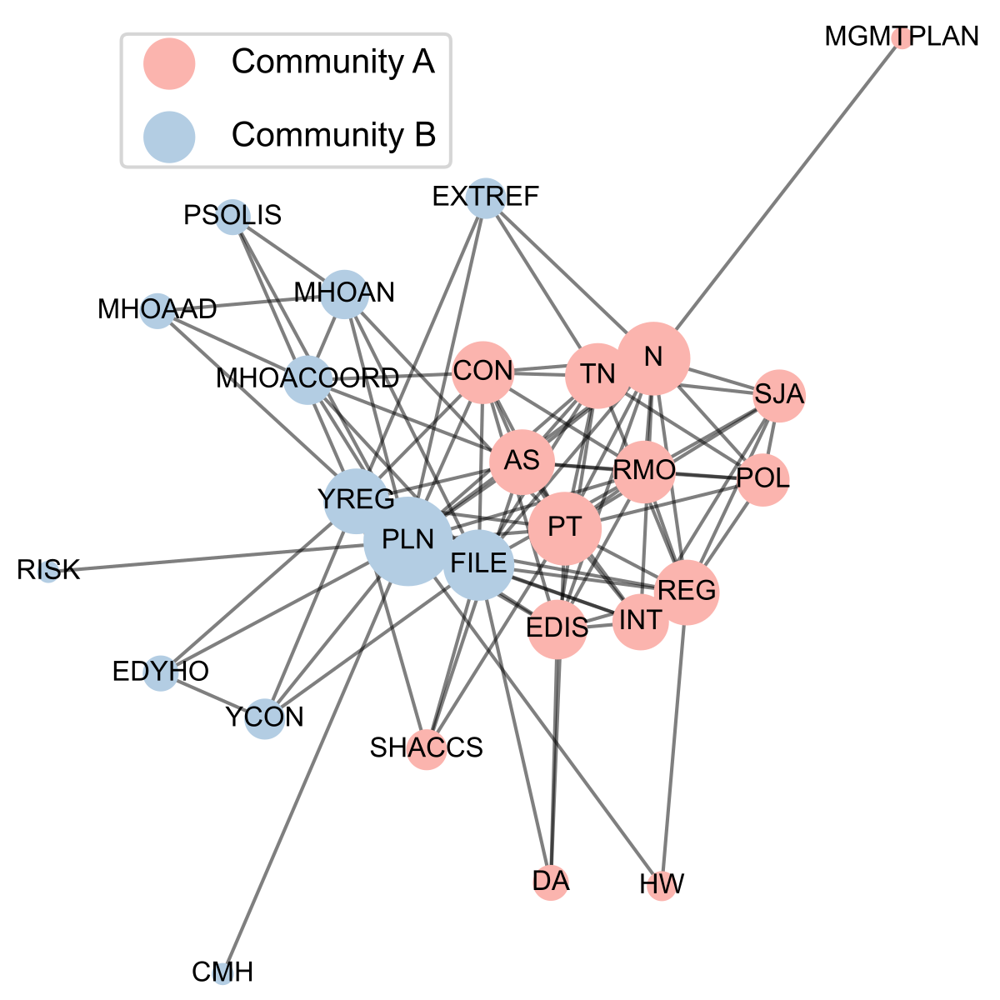

# Mapping patient interactions in psychiatric presentations to a tertiary emergency department
Jupyter notebook and Python code for the analysis of patient trajectories in a hospital emergency department for individuals presenting with suspected risk of suicide or self-harm, as published in our study:

> McCullough MH, Small M, Jayawardena B, Hood S (2024) Mapping clinical interactions in an Australian tertiary hospital emergency department for patients presenting with risk of suicide or self-harm: Network modeling from observational data. PLOS Medicine 21(1): e1004241. https://doi.org/10.1371/journal.pmed.1004241

 &emsp; 

## Overview
This repository contains:
* The Jupyter notebook `ED-interaction-mapping.ipynb` which runs the complete pipeline for analysing patient trajectory/interaction data, generating results and rendering figures for our published study.
* YAML file `ED-interaction-mapping.yml` for installing the conda environment.
* CSV files for the study data and lookup tables for system agents (doctors, patients etc.) and referral decisions.

## Installation and usage
To run the notebook:
1. Clone the repository.
1. Install the environment with `conda` using the included YAML file.
``` 
conda env create -f ED-interaction-mapping.yml
```
1. Run all cells in order.

<a id='data'></a>
## Data availability
The data for this project are stored within this repository in `data.csv`. Note that date information has been altered for data privacy.

## References
Please see the companion paper linked above for details of the methods and packages used in this code.

## Citing this code
If you use or adapt our code or methods in your research, please cite the companion paper linked above or as shown here in BibTeX format:
```
@article{10.1371/journal.pmed.1004241,
    doi = {10.1371/journal.pmed.1004241},
    author = {McCullough, Michael H. AND Small, Michael AND Jayawardena, Binu AND Hood, Sean},
    journal = {PLOS Medicine},
    publisher = {Public Library of Science},
    title = {Mapping clinical interactions in an Australian tertiary hospital emergency department for patients presenting with risk of suicide or self-harm: Network modeling from observational data},
    year = {2024},
    month = {01},
    volume = {21},
    url = {https://doi.org/10.1371/journal.pmed.1004241},
    pages = {1-21},
    number = {1},
}
```
This repository was archived on Zenodo upon publication:

[](https://zenodo.org/doi/10.5281/zenodo.10511734)

## Questions
Please email michael.mccullough@anu.edu.au if you have questions about the code.
